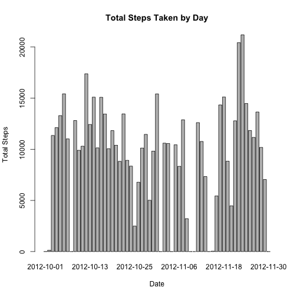
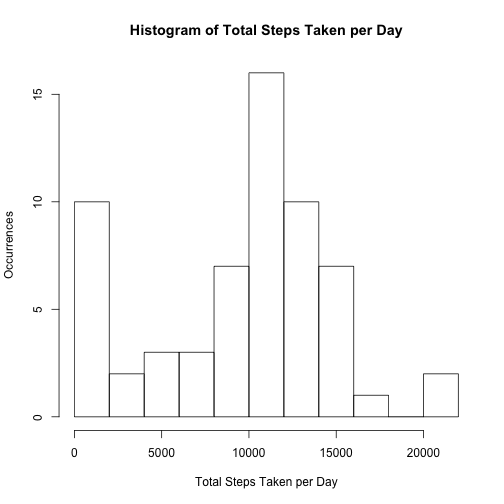
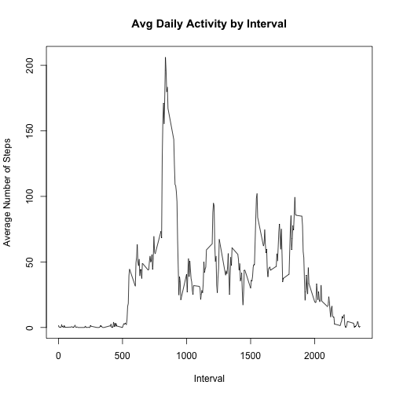
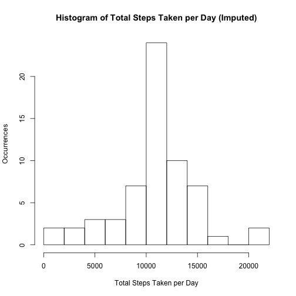
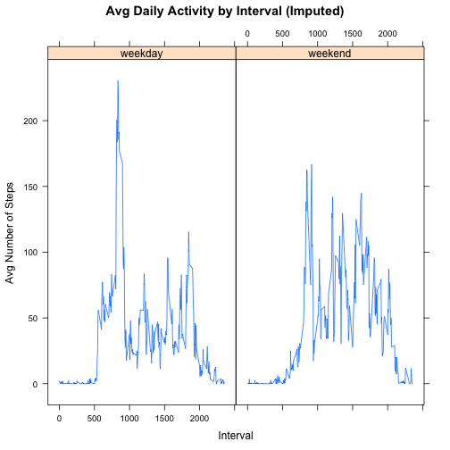

## Loading and preprocessing the data

```r
    # Unzip and load the data
    unzip("activity.zip")
    activity <- read.csv("activity.csv")
    activity$date <- as.Date(activity$date)
    
    # Take a peek
    str(activity)
```

```
## 'data.frame':	17568 obs. of  3 variables:
##  $ steps   : int  NA NA NA NA NA NA NA NA NA NA ...
##  $ date    : Date, format: "2012-10-01" "2012-10-01" ...
##  $ interval: int  0 5 10 15 20 25 30 35 40 45 ...
```

```r
    summary(activity)
```

```
##      steps             date               interval     
##  Min.   :  0.00   Min.   :2012-10-01   Min.   :   0.0  
##  1st Qu.:  0.00   1st Qu.:2012-10-16   1st Qu.: 588.8  
##  Median :  0.00   Median :2012-10-31   Median :1177.5  
##  Mean   : 37.38   Mean   :2012-10-31   Mean   :1177.5  
##  3rd Qu.: 12.00   3rd Qu.:2012-11-15   3rd Qu.:1766.2  
##  Max.   :806.00   Max.   :2012-11-30   Max.   :2355.0  
##  NA's   :2304
```

## What is mean total number of steps taken per day?

```r
    # Total steps by day
    total.steps.by.day <- tapply(activity$steps, activity$date, FUN=sum, na.rm=TRUE)
    barplot(total.steps.by.day, main="Total Steps Taken by Day", xlab="Date",
            ylab="Total Steps")
```



```r
    # Histogram of total steps taken per day
    hist(total.steps.by.day, breaks=10, main="Histogram of Total Steps Taken per Day",
         xlab="Total Steps Taken per Day", ylab="Occurrences")
```



```r
    # Mean and median of total steps taken per day
    mean.steps <- mean(total.steps.by.day)
    median.steps <- median(total.steps.by.day)
    out.txt <- paste0("Mean Total Steps Taken per Day:    ", mean.steps,
                      "\nMedian Total Steps Taken per Day:  ", median.steps)
    cat(out.txt)
```

```
## Mean Total Steps Taken per Day:    9354.22950819672
## Median Total Steps Taken per Day:  10395
```

## What is the average daily activity pattern?

```r
    # Average daily activity pattern
    avg.steps.by.interval <- tapply(activity$steps, activity$interval, FUN=mean,
                                    na.rm=TRUE)
    plot(x=names(avg.steps.by.interval), y=avg.steps.by.interval, type="l",
         main="Avg Daily Activity by Interval",
         xlab="Interval", ylab="Average Number of Steps")
```



```r
    max.interval <- names(which(avg.steps.by.interval==max(avg.steps.by.interval)))
    paste0("Interval containing maximum steps:  ", max.interval)
```

```
## [1] "Interval containing maximum steps:  835"
```


## Imputing missing values

```r
    # How many NAs?
    num.na.rows = length(activity$steps[is.na(activity$steps)])
    paste0("Number of NA rows:  ", num.na.rows)
```

```
## [1] "Number of NA rows:  2304"
```

```r
    # Create a new dataset and fill with imputed values of interval averages as necessary
    activity.imputed <- merge(x=activity, y=avg.steps.by.interval,
                                   by.x="interval", by.y=0)
    activity.imputed$steps[is.na(activity.imputed$steps)] <-
        activity.imputed$y[is.na(activity.imputed$steps)]
    
    # Total steps by day (imputed)
    total.steps.by.day <- tapply(activity.imputed$steps, activity.imputed$date, FUN=sum,
                                 na.rm=TRUE)
    # Histogram of total steps taken per day (imputed)
    hist(total.steps.by.day, breaks=10, main="Histogram of Total Steps Taken per Day (Imputed)",
         xlab="Total Steps Taken per Day", ylab="Occurrences")
```



```r
    # Mean and median of total steps taken per day
    mean.steps <- mean(total.steps.by.day)
    median.steps <- median(total.steps.by.day)
    out.txt <- paste0("Mean Total Steps Taken per Day:    ", mean.steps,
                      "\nMedian Total Steps Taken per Day:  ", median.steps,
                      "\nImputation causes distribution of step totals to be more centered",
                      "\nand raises both the mean and median step totals")
    cat(out.txt)
```

```
## Mean Total Steps Taken per Day:    10766.1886792453
## Median Total Steps Taken per Day:  10766.1886792453
## Imputation causes distribution of step totals to be more centered
## and raises both the mean and median step totals
```

## Are there differences in activity patterns between weekdays and weekends?

```r
    # Create and populate day.type column
    activity.imputed$dow <- weekdays(activity.imputed$date)
    activity.imputed$day.type <- "weekday"
    activity.imputed$day.type[activity.imputed$dow %in% c("Saturday", "Sunday")] <- "weekend"
    activity.imputed$day.type <- as.factor(activity.imputed$day.type)

    # Average daily activity pattern (using imputed data)
    avg.steps.by.interval.day.type <- aggregate(steps ~ interval + day.type, 
                                                data=activity.imputed, FUN="mean")

    # Create panel plot comparing weekday and weekend average daily steps
    library(lattice)
    xyplot(steps ~ interval | day.type, data=avg.steps.by.interval.day.type, 
           type="l", main="Avg Daily Activity by Interval (Imputed)", 
           xlab="Interval", ylab="Avg Number of Steps")
```


